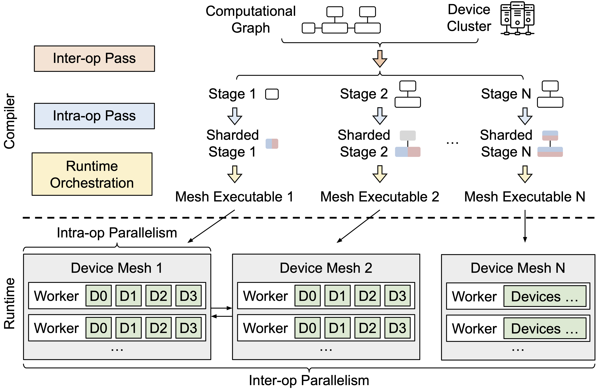
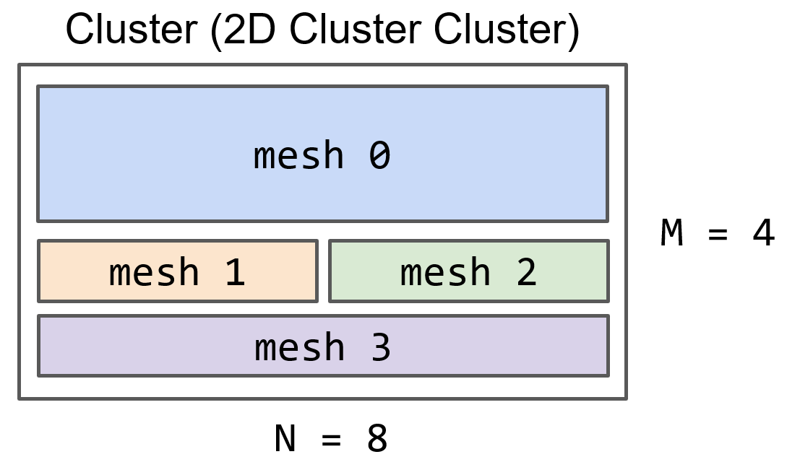
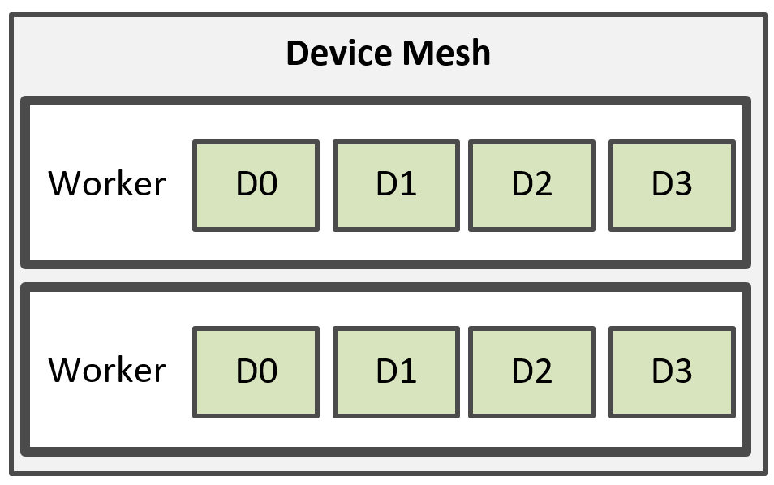

=======================
Design and Architecture
=======================

This document aims to describe the architecture of Alpa and explain several core concepts and compilation passes introduced by Alpa at a high level. It provides an overview of Alpa's architecture, including core terms and componenents introduced by Alpa. In :ref:`Alpa Compiler Walk-Through <Alpa Compiler Walk-Through>`, we further show the workflow of Alpa using an MLP example.

You are recommended to read the the following materials as well:

- `Alpa paper <https://arxiv.org/pdf/2201.12023.pdf>`_ (OSDI'22)
- `Google AI blog <https://ai.googleblog.com/2022/05/alpa-automated-model-parallel-deep.html>`_
- `Alpa talk slides <https://docs.google.com/presentation/d/1CQ4S1ff8yURk9XmL5lpQOoMMlsjw4m0zPS6zYDcyp7Y/edit?usp=sharing>`_

Overview
========

:ref:`The figure below <architecture>` shows a high-level diagram of Alpa's architecture.

.. _architecture:

  Figure 1: Alpa architecture diagram.

Like many existing machine learning compilers, Alpa parallelizes the ML computation in two steps: a compilation step, followed by a runtime step.

In the compilation step, Alpa takes a model description, in the form of a :ref:`computational graph<cg>`, and a :ref:`device cluster<device-cluster>` as inputs, and performs a few compilation passes and optimizations to generate
a model-parallel execution plan, which is *custom-made* for the model and cluster. Alpa then generates binary executables based on the training code and parallel execution plan, for each parcipating compute device in the cluster.
In the runtime step, Alpa orchestrates the parallel execution of these executables on the cluster.

Compilation
===========

Before we start introducing the compilation architecture, we bring in two important concepts introduced by Alpa.
Unlike many existing distributed ML training systems, Alpa views existing ML parallelization approaches into two orthogonal categories:
**intra-operator parallelism** and **inter-operator parallelism**. They are distinguished by the fact that if the parallelism approach involves partitioning any computational operator of the model along one (or more) tensor axis.
Some examples falling into the two categories are listed below:

- **Intra-op parallelism**: data parallelism, Megatron-LM's tensor model parallelism, operator parallelism such as those in ToFu and FlexFlow, etc.
- **Inter-op parallelism**: device placement, pipeline parallelism and their variants.

For a deeper dive into what these two classes of parallelism entail, please read the documentation about our rationale.

This new view of ML parallelization techniques is the core part that drives Alpa's design: Alpa unifies existing ML parallelization methods following this
view by realizing them in a two-level hierarchy shown in :ref:`Figure 1<architecture>`. At the upper level, Alpa designs a set of algorithms and compilation passes, which we call
**inter-op pass** to generate parallel execution plan corresponding to all inter-op parallelisms; at the lower level, Alpa designs another set of algorithms and
compilation passes, which we call **intra-op pass**, to generate the parallel execution plan mapping to all intra-op parallelisms.

Alpa can guarantee the plan generated at each individual level is *locally optimal*.
Once the two-level plans are generated, Alpa runs a third pass **runtime orchestration pass**. In this pass, Alpa applies the plans on the input computational graph,
performs some post-processing, and finally compile the original, single-node graph into parallel executables. It then sends the parallel executables to devices on the cluster.

Important concepts
------------------

Understanding the following concepts are necessary to understand what each pass is precisely doing during compilation.

.. _cg:

Computational graph
###################
Like many machine learning compiler systems, Alpa represents the model computation as a static computational graph.
For now, this computational graph is first extracted from the user code and expressed using the `JaxPR intermediate representation <https://jax.readthedocs.io/en/latest/jaxpr.html>`__,
and then lowered to the `XLA HLO representation <https://www.tensorflow.org/xla/operation_semantics>`__.

.. _device-cluster:

Device cluster
##############
Alpa runs on a cluster of compute devices, managed by Ray_. For example, a cluster of four AWS p3.16xlarge nodes, with 8 GPUs on each node, form an 4x8 device cluster, illustrated
in :ref:`Figure 2<cluster-mesh>` below. We also call this device cluster *the cluster mesh*.

.. _cluster-mesh:

  Figure 2: an M x N cluster mesh.

Device mesh
###########

Alpa's :ref:`inter-op compilation pass<inter-op-pass>` will slice the cluster mesh into multiple groups of devices. Each group might contain a number of devices
with high communication bandwidth, such as `NVIDIA NVLink <https://www.nvidia.com/en-us/data-center/nvlink/>`__. We call each group of devices a device mesh.
:ref:`Figure 2<cluster-mesh>` shows how a cluster mesh is sliced into 4 device meshes.

Worker
######

Each device mesh might consist of partial or full devices from a single node or from multiple nodes. Alpa uses a worker to manage multiple devices from a node; hence a device mesh might contain multiple workers, each mapping to a process that manages multiple devices on a node.
For example, :ref:`Figure 3<mesh-worker>` shows a mesh, consisted of 2 workers, and each worker manages 4 devices.
The workers are implemented as `Ray actors <https://github.com/alpa-projects/alpa/blob/main/alpa/device_mesh.py>`__.

.. _mesh-worker:

  Figure 3: A mesh is consisted of multiple workers managing devices.

Stage
#####
Alpa slices the input computational graph into multiple, adjacent subgraphs. We call each subgraph a stage.

Resharding
##########
# TODO

Compilation Passes
------------------
With the above concepts, we now explain what each compilation pass is exactly doing.

.. _inter-op-pass:

Inter-op Pass
#############

Inter-op pass slices the computational graph into multiple stages and the cluster mesh into multiple smaller device meshes; it then assigns each stage to a mesh.
Alpa generates the slicing and assignment scheme optimally using a dynamic programming algorithm to minimize the inter-op parallel execution latency.

Intra-op pass
#############
Intra-op pass looks at each <stage, mesh> pair generated by the inter-op pass, and generates the optimal intra-op parallelism execution plan for this stage to run on its assigned mesh.

Runtime Orchestratoin pass
##########################
The runtime orchestration pass looks at the pairs of stages and meshes generated by the inter-op pass, and the intra-op parallelism strategy generated for each <stage, mesh> pair by the intra-op pass.
It analyzes their data dependency, and tries to fullfills some requirements before runtime. These requirements include:

- **Communication**: sending a tensor from a stage to its next stage. When the two stages have different intra-op parallelism execution plan, the tensor might be sharded differently on two meshes.
  In that case, cross-mesh resharding is required. Alpa's runtime orchestration pass will try to generate the optimal scheme on how to communicate the tensors between two meshes.
- **Scheduling**: Alpa's runtime will also compile and generate static scheduling instructions for pipelined execution of all stages, to minimize scheduling overheads at Runtime.

These three compilation passes are implemented on top of XLA_ and GSPMD_.
Despite the compilation passes for distributed execution, XLA_ and GSPMD_ additionally perform some other necessary optimizations to improve the single-device execution performance.

.. _XLA: https://www.tensorflow.org/xla
.. _GSPMD: https://arxiv.org/pdf/2105.04663.pdf

Runtime
=======
Alpa implements a runtime_ to orchestrate the inter-op parallel execution of different stages on these meshes.
For each stage, Alpa uses the GSPMD runtime to parallelize its execution on its assigned device mesh, following the intra-op parallelism execution plan generated by the intra-op pass.

.. _Ray: https://github.com/ray-project/ray
.. _MLP: tutorial/getting_started
.. _worker: https://github.com/alpa-projects/alpa/blob/main/alpa/device_mesh.py#L64
.. _runtime: https://github.com/alpa-projects/alpa/blob/main/alpa/pipeline_parallel/decentralized_distributed_runtime.py
