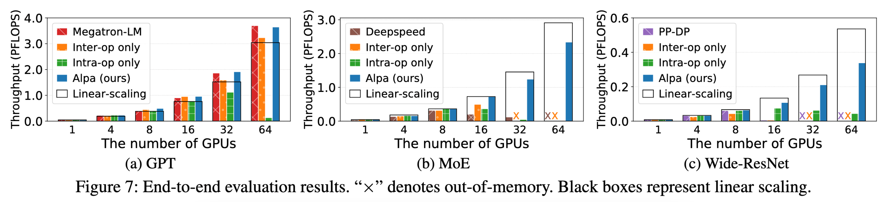

Performance Benchmark
=====================

The figure below shows the scaling efficiency of Alpa on training models with billions of parameters on an AWS cluster.
The instructions to reproduce the benchmark results is in this `README.md <https://github.com/alpa-projects/alpa/blob/main/benchmark/alpa/README.md>`_.
The explanation of the results can be found in Section 8.1 of `Alpa paper <https://arxiv.org/pdf/2201.12023.pdf>`_.

.. raw:: html

    
